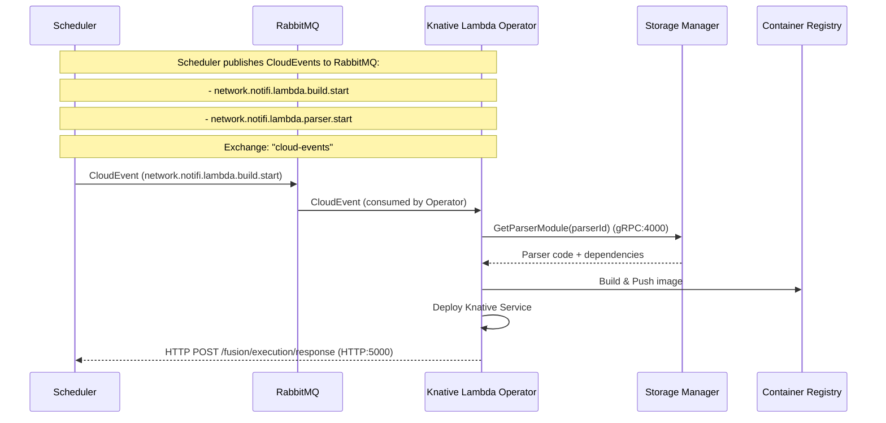
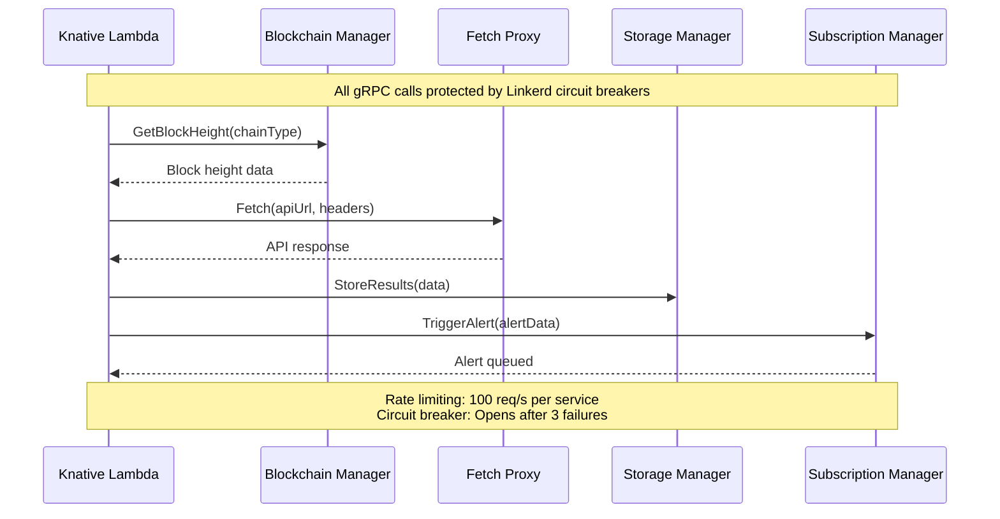
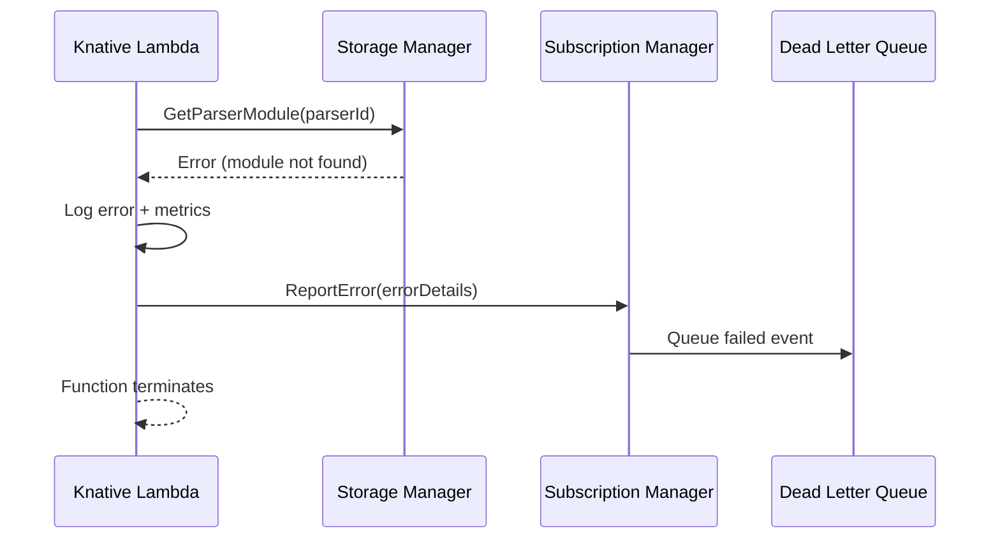

# 🔗 Notifi Integration Architecture

**How Knative Lambda integrates with the Notifi notification platform**

---

## 📖 Table of Contents

- [Overview](#overview)
- [Notifi Services](#notifi-services)
- [Integration Architecture](#integration-architecture)
- [Service Dependencies](#service-dependencies)
- [Communication Patterns](#communication-patterns)
- [Configuration Management](#configuration-management)

---

## 🎯 Overview

Knative Lambda serves as the **serverless execution platform** for Notifi's **Fusion** system - a dynamic notification processing engine. The integration enables:

- **Dynamic Parser Deployment**: Deploy blockchain transaction parsers as serverless functions
- **Event-Driven Processing**: Process blockchain events through CloudEvents
- **Auto-Scaling**: Handle variable loads with scale-to-zero capabilities
- **Multi-Chain Support**: Support for EVM, Solana, Sui, and other blockchain networks

### Key Integration Points

```
┌─────────────────────────────────────────────────────────────────┐
│                    NOTIFI FUSION PLATFORM                       │
├─────────────────────────────────────────────────────────────────┤
│                                                                 │
│  📊 Notifi Services (Kubernetes)                                │
│  ├─ Subscription Manager (User subscriptions)                   │
│  ├─ Storage Manager (Data persistence)                          │
│  ├─ Fetch Proxy (External API calls)                            │
│  └─ Blockchain Manager (RPC access)                             │
│                                                                 │
│  ⚡ Knative Lambda (Serverless Functions)                        │
│  ├─ Parser Functions (Transaction processing)                   │
│  ├─ Filter Functions (Event filtering)                          │
│  └─ Alert Functions (Notification generation)                   │
│                                                                 │
└─────────────────────────────────────────────────────────────────┘
```

---

## 🏗️ Notifi Services

### 0. Scheduler Service

**Purpose**: Orchestrates Lambda function lifecycle and execution, publishes CloudEvents to trigger builds and parser execution

**Service Details**:
- **HTTP Port**: 5000 (Http1) - REST API endpoints
- **gRPC Port**: 4000 (Http2) - gRPC service calls
- **Health Port**: 6000 (Http2) - Health checks
- **Metrics Port**: 7000 (Http1) - Prometheus metrics
- **Address**: `notifi-scheduler.notifi.svc.cluster.local:5000` (HTTP), `:4000` (gRPC)
- **Protocol**: HTTP (REST) and gRPC (HTTP/2)
- **Namespace**: `notifi`

**Key Responsibilities**:
- ✅ Publishes CloudEvents to RabbitMQ (exchange: "cloud-events")
- ✅ Receives execution response callbacks from Lambda functions
- ✅ Manages function lifecycle (build.start, parser.start)
- ✅ Integrates with RateLimitBroker for capacity management
- ✅ Queues events to EventProcessor
- ✅ Monitors execution via Monitor service

**CloudEvents Published**:
- `network.notifi.lambda.build.start` - Triggers build process
- `network.notifi.lambda.parser.start` - Triggers parser execution

**HTTP Endpoints**:
- `POST /fusion/execution/response` - Receives execution callbacks from Lambda functions

**Integration with Knative Lambda**:
- Publishes CloudEvents to RabbitMQ that the Operator consumes
- Receives HTTP callbacks from deployed Lambda functions
- Manages the complete lifecycle from build to execution

**Dependencies**:
- RabbitMQ (CloudEvents broker)
- RateLimitBroker (capacity management)
- EventProcessor (event queuing)
- Monitor (monitoring and failure handling)
- Storage Manager (parser retrieval)
- FusionManager (Fusion source management)

### 1. Subscription Manager

**Purpose**: Manages user subscriptions and alert configurations

**Service Details**:
- **HTTP Port**: 5000 (Http1) - REST API endpoints
- **gRPC Port**: 4000 (Http2) - gRPC service calls
- **Health Port**: 6000 (Http2) - Health checks
- **Metrics Port**: 7000 (Http1) - Prometheus metrics
- **Address**: `notifi-subscription-manager.notifi.svc.cluster.local:4000` (gRPC)
- **Protocol**: gRPC with HTTP/2
- **Namespace**: `notifi`

**Key Responsibilities**:
- ✅ User subscription management
- ✅ Alert creation and configuration
- ✅ Target group management (email, SMS, webhook)
- ✅ Fusion alert processing
- ✅ Database operations (PostgreSQL)

**Integration with Knative Lambda**:
- Receives processed events from Lambda functions
- Stores alert configurations for function execution
- Manages user preferences for notification delivery

### 2. Storage Manager

**Purpose**: Provides persistent and ephemeral storage for Fusion modules and data

**Service Details**:
- **HTTP Port**: 5000 (Http1) - REST API endpoints
- **gRPC Port**: 4000 (Http2) - gRPC service calls
- **Health Port**: 6000 (Http2) - Health checks
- **Metrics Port**: 7000 (Http1) - Prometheus metrics
- **Address**: `notifi-storage-manager.notifi.svc.cluster.local:4000` (gRPC)
- **Protocol**: gRPC with HTTP/2
- **Namespace**: `notifi`

**Key Responsibilities**:
- ✅ **Block Storage**: Cached blockchain blocks
- ✅ **Module Storage**: Fusion parser modules
- ✅ **Parser Storage**: Dynamic parser code
- ✅ **Log Storage**: Execution logs and analytics
- ✅ **Object Storage Integration**: MinIO (default), AWS S3 or Google Cloud Storage (optional)

**Storage Types**:
- **Persistent Storage**: Long-term data (modules, configurations)
- **Ephemeral Storage**: Temporary data (queues, caches)

**Integration with Knative Lambda**:
- Stores parser code uploaded to object storage (MinIO default, S3/GCS optional)
- Provides module retrieval for function execution
- Manages execution logs and analytics data

### 3. Fetch Proxy

**Purpose**: Secure HTTP client for external API calls from Fusion functions

**Service Details**:
- **HTTP Port**: 5000 (Http1) - REST API endpoints
- **gRPC Port**: 4000 (Http2) - gRPC service calls
- **Health Port**: 6000 (Http2) - Health checks
- **Metrics Port**: 7000 (Http1) - Prometheus metrics
- **Address**: `notifi-fetch-proxy.notifi.svc.cluster.local:4000` (gRPC)
- **Protocol**: gRPC with HTTP/2
- **Namespace**: `notifi`

**Key Responsibilities**:
- ✅ **HTTP Proxy**: Secure external API calls
- ✅ **Rate Limiting**: Quota enforcement
- ✅ **Regional Routing**: Multi-region support
- ✅ **Security**: Request validation and sanitization
- ✅ **Monitoring**: Request/response tracking

**Supported Operations**:
- GET, POST, PUT, DELETE, HEAD requests
- JSON payload support
- Custom headers
- Regional routing (US-West-2, EU-West-1)

**Integration with Knative Lambda**:
- Lambda functions use Fetch Proxy for external API calls
- Enforces rate limits and quotas
- Provides secure access to external services

### 4. Blockchain Manager

**Purpose**: Unified interface for blockchain RPC access across multiple networks

**Service Details**:
- **HTTP Port**: 5000 (Http1) - REST API endpoints
- **gRPC Port**: 4000 (Http2) - gRPC service calls
- **Health Port**: 6000 (Http2) - Health checks
- **Metrics Port**: 7000 (Http1) - Prometheus metrics
- **Address**: `notifi-blockchain-manager.notifi.svc.cluster.local:4000` (gRPC)
- **Protocol**: gRPC with HTTP/2
- **Namespace**: `notifi`

**Key Responsibilities**:
- ✅ **Multi-Chain RPC**: EVM, Solana, Sui, Cosmos support
- ✅ **Block Data**: Block height, block retrieval
- ✅ **Account Data**: Balance queries, transaction data
- ✅ **Signature Validation**: Message and transaction validation
- ✅ **Rate Limiting**: RPC call quotas and QoS

**Supported Blockchains**:
- **EVM**: Ethereum, Polygon, Arbitrum, Avalanche, BSC, Optimism, Base
- **Solana**: Mainnet and testnet
- **Sui**: Mainnet and testnet
- **Cosmos**: Osmosis, Xion

**Integration with Knative Lambda**:
- Lambda functions query blockchain data through Blockchain Manager
- Provides consistent API across different blockchain networks
- Handles RPC rate limiting and failover

---

## 🔄 Integration Architecture

### Data Flow Overview

```
┌─────────────────────────────────────────────────────────────────┐
│                    FUSION EXECUTION FLOW                        │
├─────────────────────────────────────────────────────────────────┤
│                                                                 │
│  1. EVENT INGESTION                                             │
│     ├─ Blockchain Event → Scheduler Service                     │
│     └─ CloudEvent → RabbitMQ (Exchange: "cloud-events")         │
│        Routing Keys:                                            │
│        - network.notifi.lambda.build.start                      │
│        - network.notifi.lambda.parser.start                     │
│                                                                 │
│  2. FUNCTION DEPLOYMENT                                         │
│     ├─ Scheduler → RabbitMQ → Knative Lambda Operator          │
│     │   (network.notifi.lambda.build.start)                     │
│     ├─ Operator → Storage Manager (get parser)                  │
│     └─ Operator → Container Registry (deploy function)          │
│                                                                 │
│  3. FUNCTION EXECUTION                                          │
│     ├─ Function → Blockchain Manager (get block data)           │
│     ├─ Function → Fetch Proxy (external API calls)              │
│     ├─ Function → Storage Manager (store results)               │
│     └─ Function → Subscription Manager (trigger alerts)         │
│                                                                 │
│  4. NOTIFICATION DELIVERY                                       │
│     ├─ Subscription Manager → Messaging Services                │
│     └─ User receives notification                               │
│                                                                 │
└─────────────────────────────────────────────────────────────────┘
```

### Service Communication Matrix

| From Service | To Service | Protocol | Purpose |
|--------------|------------|----------|---------|
| **Scheduler** | **RabbitMQ** | CloudEvents | Publish build/parser start events (exchange: "cloud-events") |
| **RabbitMQ** | **Knative Lambda Operator** | CloudEvents | Function lifecycle management (build.start, parser.start) |
| **Lambda Functions** | **Scheduler** | HTTP | Send execution response callbacks (POST /fusion/execution/response) |
| **Lambda Functions** | **Storage Manager** | gRPC | Retrieve parser modules |
| **Lambda Functions** | **Blockchain Manager** | gRPC | Query blockchain data |
| **Lambda Functions** | **Fetch Proxy** | gRPC | Make external API calls |
| **Lambda Functions** | **Subscription Manager** | gRPC | Trigger alert processing |
| **Scheduler** | **RateLimitBroker** | gRPC | Request capacity for event queuing |
| **Scheduler** | **EventProcessor** | gRPC | Queue parsed events |
| **Scheduler** | **Monitor** | gRPC | Mark events as failed, activate cursors |
| **Storage Manager** | **MinIO/S3/GCS** | HTTP | Store/retrieve modules (MinIO default) |

---

## 🔗 Service Dependencies

### Knative Lambda Dependencies

**Required Services**:
```yaml
dependencies:
  - name: scheduler
    address: "notifi-scheduler.notifi.svc.cluster.local:5000"  # HTTP
    addressGrpc: "notifi-scheduler.notifi.svc.cluster.local:4000"  # gRPC
    protocol: http  # For callbacks
    protocolGrpc: grpc  # For gRPC calls
    purpose: "Function lifecycle orchestration and execution callbacks"
  
  - name: subscription-manager
    address: "notifi-subscription-manager.notifi.svc.cluster.local:4000"
    protocol: grpc
    purpose: "Alert processing and user management"
  
  - name: storage-manager
    address: "notifi-storage-manager.notifi.svc.cluster.local:4000"
    protocol: grpc
    purpose: "Module and data storage"
  
  - name: fetch-proxy
    address: "notifi-fetch-proxy.notifi.svc.cluster.local:4000"
    protocol: grpc
    purpose: "External API access"
  
  - name: blockchain-manager
    address: "notifi-blockchain-manager.notifi.svc.cluster.local:4000"
    protocol: grpc
    purpose: "Blockchain RPC access"
```

### Configuration Constants

```go
const (
    // Notifi Service Addresses
    NotifiSchedulerAddressDefault            = "notifi-scheduler.notifi.svc.cluster.local:5000"  // HTTP
    NotifiSchedulerGrpcAddressDefault        = "notifi-scheduler.notifi.svc.cluster.local:4000"  // gRPC
    NotifiSubscriptionManagerAddressDefault   = "notifi-subscription-manager.notifi.svc.cluster.local:4000"
    NotifiEphemeralStorageAddressDefault     = "notifi-storage-manager.notifi.svc.cluster.local:4000"
    NotifiPersistentStorageAddressDefault    = "notifi-storage-manager.notifi.svc.cluster.local:4000"
    NotifiFusionFetchProxyAddressDefault     = "notifi-fetch-proxy.notifi.svc.cluster.local:4000"
    NotifiEvmRPCAddressDefault               = "notifi-blockchain-manager.notifi.svc.cluster.local:4000"
    NotifiSolanaRPCAddressDefault            = "notifi-blockchain-manager.notifi.svc.cluster.local:4000"
    NotifiSuiRPCAddressDefault               = "notifi-blockchain-manager.notifi.svc.cluster.local:4000"
    NotifiGrpcInsecureDefault                = true
)
```

---

## 📡 Communication Patterns

### 1. Function Lifecycle Management Flow



### 2. Function Execution Flow



### 3. Error Handling Flow



---

## ⚙️ Configuration Management

### Environment Variables

**Knative Lambda Configuration**:
```yaml
env:
  # Notifi Service URLs
  - name: NOTIFI_SUBSCRIPTION_MANAGER_URL
    value: "http://notifi-subscription-manager.notifi.svc.cluster.local:4000"
  - name: NOTIFI_STORAGE_MANAGER_URL
    value: "http://notifi-storage-manager.notifi.svc.cluster.local:4000"
  - name: NOTIFI_FETCH_PROXY_URL
    value: "http://notifi-fetch-proxy.notifi.svc.cluster.local:4000"
  - name: NOTIFI_BLOCKCHAIN_MANAGER_URL
    value: "http://notifi-blockchain-manager.notifi.svc.cluster.local:4000"
  
  # gRPC Configuration
  - name: NOTIFI_GRPC_INSECURE
    value: "true"
  
  # Service Discovery
  - name: NOTIFI_NAMESPACE
    value: "notifi"
```

### Service Discovery

**Kubernetes DNS Resolution**:
```yaml
# Service names resolve to ClusterIP addresses
notifi-subscription-manager.notifi.svc.cluster.local:4000
notifi-storage-manager.notifi.svc.cluster.local:4000
notifi-fetch-proxy.notifi.svc.cluster.local:4000
notifi-blockchain-manager.notifi.svc.cluster.local:4000
```

### Network Policies

**Required Network Access**:
```yaml
apiVersion: networking.k8s.io/v1
kind: NetworkPolicy
metadata:
  name: knative-lambda-notifi-access
spec:
  podSelector:
    matchLabels:
      app: knative-lambda-builder
  policyTypes:
  - Egress
  egress:
  - to:
    - namespaceSelector:
        matchLabels:
          name: notifi
    ports:
    - protocol: TCP
      port: 4000
```

---

## 🔒 Security Considerations

### Authentication & Authorization

**gRPC Security**:
- **Insecure Mode**: `NotifiGrpcInsecureDefault = true` (for internal cluster)
- **TLS**: Disabled for internal cluster communication
- **mTLS**: Automatic via Linkerd service mesh (all pod-to-pod traffic encrypted)

**Service-to-Service Authentication**:
- Kubernetes service accounts
- RBAC policies for service access
- Network policies for traffic isolation
- Linkerd automatic mTLS for zero-trust networking

### Rate Limiting & Circuit Breakers

**Linkerd Policy API for Notifi Services**:
All gRPC/HTTP calls from Lambda functions and AI Agent to Notifi services are protected by Linkerd Policy API (Server + ServerAuthorization) with circuit breakers and rate limiting:

```yaml
# Example: Scheduler Server (HTTP:5000)
apiVersion: policy.linkerd.io/v1beta3
kind: Server
metadata:
  name: scheduler-server
  namespace: notifi
spec:
  podSelector:
    matchLabels:
      app: scheduler
  port: 5000  # HTTP port (standard Notifi service pattern)
  proxyProtocol: HTTP/1

---
# Example: Storage Manager Server (gRPC:4000)
apiVersion: policy.linkerd.io/v1beta3
kind: Server
metadata:
  name: storage-manager-server
  namespace: notifi
spec:
  podSelector:
    matchLabels:
      app: storage-manager
  port: 4000  # gRPC port (standard Notifi service pattern)
  proxyProtocol: HTTP/2  # gRPC uses HTTP/2
  clientConnectionPolicy:
    maxConnections: 100
    maxPendingRequests: 50

---
# ServerAuthorization for Storage Manager
apiVersion: policy.linkerd.io/v1beta1
kind: ServerAuthorization
metadata:
  name: storage-manager-auth
  namespace: notifi
spec:
  server:
    name: storage-manager-server
  client:
    meshTLS:
      identities:
      - "*.knative-lambda.svc.cluster.local"
      - "*.notifi.svc.cluster.local"

---
# HTTPLocalRateLimitPolicy for rate limiting
apiVersion: policy.linkerd.io/v1beta3
kind: HTTPLocalRateLimitPolicy
metadata:
  name: storage-manager-rate-limit
  namespace: notifi
spec:
  targetRef:
    group: policy.linkerd.io
    kind: Server
    name: storage-manager-server
  conditions:
    # Global rate limit for all inbound traffic
    - requestsPerSecond: 100
    # Per-identity rate limits (fairness)
    - requestsPerSecond: 10
      client:
        meshTLS:
          identities:
          - "*.knative-lambda.svc.cluster.local"
```

**Rate Limits**:
- **Per service (global)**: 100 req/s per pod (all inbound traffic)
- **Per Lambda function**: 10 req/s per service (fairness - prevents single function overload)
- **Per AI Agent**: 20 req/s per service (higher quota for investigations)
- **Per route**: Configurable via HTTPRoute (Gateway API) or connection limits in Server
- **Algorithm**: Generic Cell Rate Algorithm (GCRA) - more performant than token bucket/leaky bucket

**Circuit Breaker Behavior**:
- **Opens after**: 3 consecutive failures OR 50% failure rate over 10s
- **Half-open after**: 30s
- **Closes after**: 1 successful request
- **Protection**: Prevents cascading failures when Notifi services are overloaded

**Benefits**:
- Protects Notifi services from overload
- Prevents single Lambda function from consuming all quota
- Automatic retry with exponential backoff
- Observability via Linkerd dashboard

### Data Privacy

**Sensitive Data Handling**:
- Parser code stored in object storage (MinIO default, S3/GCS optional, encrypted at rest)
- User data encrypted in transit (gRPC + Linkerd mTLS)
- No external exposure of internal services

---

## 📊 Monitoring & Observability

### Metrics Integration

**Prometheus Metrics**:
```yaml
# Knative Lambda metrics
knative_lambda_build_duration_seconds
knative_lambda_function_executions_total
knative_lambda_notifi_service_calls_total

# Notifi service metrics
notifi_subscription_manager_requests_total
notifi_storage_manager_operations_total
notifi_fetch_proxy_requests_total
notifi_blockchain_manager_rpc_calls_total
```

### Tracing Integration

**OpenTelemetry Traces**:
- End-to-end request tracing
- Service dependency mapping
- Performance bottleneck identification

### Logging

**Structured Logging**:
```json
{
  "timestamp": "2025-01-19T10:30:00Z",
  "level": "info",
  "service": "knative-lambda",
  "operation": "function_execution",
  "parser_id": "evm-transaction-parser-v1",
  "notifi_service": "blockchain-manager",
  "duration_ms": 150,
  "trace_id": "550e8400-e29b-41d4-a716-446655440000"
}
```

---

## 🚀 Deployment Considerations

### Resource Requirements

**Knative Lambda**:
- **CPU**: 100m-500m per function
- **Memory**: 128Mi-512Mi per function
- **Storage**: Ephemeral (no persistent storage)

**Notifi Services**:
- **CPU**: 25m-80m per service
- **Memory**: 256Mi-512Mi per service
- **Storage**: Persistent (PostgreSQL, Redis, MinIO/S3/GCS)

### Scaling Characteristics

**Knative Lambda**:
- **Scale-to-Zero**: ✅ Idle functions consume 0 resources
- **Rapid Scale-up**: 0→N pods in <30 seconds
- **Concurrent Executions**: 100+ per function

**Notifi Services**:
- **Always-On**: Services run continuously
- **Horizontal Scaling**: 1-3 replicas per service
- **Load Balancing**: Internal Kubernetes load balancing

---

## 🔧 Troubleshooting

### Common Issues

**Service Discovery Failures**:
```bash
# Check service endpoints
kubectl get endpoints -n notifi

# Test DNS resolution
kubectl run test-pod --image=busybox --rm -it -- nslookup notifi-subscription-manager.notifi.svc.cluster.local
```

**gRPC Connection Issues**:
```bash
# Check service health
kubectl port-forward -n notifi svc/notifi-subscription-manager 4000:4000
grpcurl -plaintext localhost:4000 list
```

**Function Execution Failures**:
```bash
# Check function logs
kubectl logs -n knative-lambda deployment/knative-lambda-builder

# Check function status
kubectl get ksvc -n knative-lambda
```

---

**Last Updated**: December 4, 2025  
**Version**: 1.0.1
