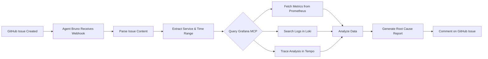
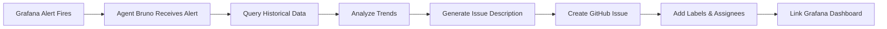

# 🔌 MCP Integration Workflows

**[← Back to README](../README.md)** | **[MCP Deployment](MCP_DEPLOYMENT_PATTERNS.md)** | **[Architecture](ARCHITECTURE.md)** | **[RBAC](RBAC.md)**

---

## Overview

Agent Bruno integrates with external services through the Model Context Protocol (MCP), enabling sophisticated workflows that combine AI intelligence with enterprise tools. This document details common workflows using **GitHub MCP** and **Grafana MCP** integrations.

---

## 🎯 Available MCP Servers

### 1. GitHub MCP
**Capabilities**:
- Issue management (create, read, update, comment)
- Pull request operations
- Repository interactions
- Workflow automation
- Code search and analysis

**Connection**:
```yaml
# ConfigMap: mcp-clients-config
github-mcp:
  url: "https://github-mcp.internal.svc.cluster.local"
  type: "knative-service"
  auth: "service-account"
  
# For external GitHub MCP
github-mcp-external:
  url: "https://api.github.com/mcp"
  type: "external"
  auth: "api-key"
  secret: "github-mcp-token"
```

### 2. Grafana MCP
**Capabilities**:
- Query metrics (Prometheus/PromQL)
- Search logs (Loki/LogQL)
- Trace analysis (Tempo/TraceQL)
- Dashboard data retrieval
- Alert rule queries
- Incident management

**Connection**:
```yaml
# ConfigMap: mcp-clients-config
grafana-mcp:
  url: "https://grafana-mcp.internal.svc.cluster.local"
  type: "knative-service"
  auth: "service-account"
```

---

## 🔄 Workflow Examples

### Workflow 1: Issue-Driven Incident Investigation

**Use Case**: User reports a GitHub issue about service degradation. Agent Bruno automatically investigates using observability data.



**Implementation**:
```python
# agent_bruno/workflows/issue_investigation.py
from typing import Dict, Any
from agent_bruno.mcp.client import MCPClient
from agent_bruno.mcp.github import GitHubMCPClient
from agent_bruno.mcp.grafana import GrafanaMCPClient

async def investigate_issue(issue_url: str) -> Dict[str, Any]:
    """
    Investigate a GitHub issue using Grafana observability data.
    
    Example usage:
        result = await investigate_issue(
            "https://github.com/notifi-network/infra/issues/756"
        )
    """
    # 1. Fetch GitHub issue details
    github_client = GitHubMCPClient()
    issue = await github_client.get_issue(issue_url)
    
    # Extract metadata
    service_name = extract_service_name(issue.body)
    time_range = extract_time_range(issue.created_at)
    
    # 2. Query Grafana for observability data
    grafana_client = GrafanaMCPClient()
    
    # Fetch metrics
    metrics = await grafana_client.query_prometheus(
        query=f'rate(http_requests_total{{service="{service_name}"}}[5m])',
        start=time_range.start,
        end=time_range.end
    )
    
    # Search logs
    logs = await grafana_client.query_loki(
        query=f'{{service="{service_name}"}} |= "error" or "exception"',
        start=time_range.start,
        end=time_range.end,
        limit=100
    )
    
    # Analyze traces
    traces = await grafana_client.search_traces(
        service=service_name,
        start=time_range.start,
        end=time_range.end,
        min_duration="1s"  # Only slow traces
    )
    
    # 3. Analyze data with AI
    analysis = await analyze_with_llm({
        "issue": issue,
        "metrics": metrics,
        "logs": logs,
        "traces": traces
    })
    
    # 4. Generate report and comment
    report = format_investigation_report(analysis)
    
    await github_client.add_comment(
        issue_url=issue_url,
        body=report
    )
    
    return {
        "issue_number": issue.number,
        "analysis": analysis,
        "report": report
    }


def extract_service_name(issue_body: str) -> str:
    """Extract service name from issue body."""
    # Parse issue body for service mentions
    # Could use NER or regex patterns
    patterns = [
        r"service[:\s]+([a-z0-9-]+)",
        r"component[:\s]+([a-z0-9-]+)",
        r"app[:\s]+([a-z0-9-]+)"
    ]
    # Implementation details...
    return "agent-bruno-api"  # Example


def extract_time_range(created_at: str, lookback_hours: int = 24):
    """Extract time range for investigation."""
    from datetime import datetime, timedelta
    
    end = datetime.fromisoformat(created_at.replace('Z', '+00:00'))
    start = end - timedelta(hours=lookback_hours)
    
    return TimeRange(start=start, end=end)


async def analyze_with_llm(data: Dict[str, Any]) -> Dict[str, Any]:
    """Use LLM to analyze observability data."""
    from agent_bruno.core.agent import AgentBruno
    
    agent = AgentBruno()
    
    prompt = f"""
    Analyze this production issue:
    
    Issue: {data['issue'].title}
    Description: {data['issue'].body}
    
    Observability Data:
    - Error rate: {calculate_error_rate(data['metrics'])}
    - Log errors: {len(data['logs'])} errors found
    - Slow traces: {len(data['traces'])} traces > 1s
    
    Key error logs:
    {format_top_errors(data['logs'])}
    
    Slowest traces:
    {format_slowest_traces(data['traces'])}
    
    Provide:
    1. Root cause analysis
    2. Impact assessment
    3. Recommended actions
    4. Related issues (if any)
    """
    
    analysis = await agent.analyze(prompt)
    
    return {
        "root_cause": analysis.root_cause,
        "impact": analysis.impact,
        "recommendations": analysis.recommendations,
        "confidence": analysis.confidence
    }


def format_investigation_report(analysis: Dict[str, Any]) -> str:
    """Format analysis as GitHub comment."""
    return f"""
## 🤖 Automated Investigation Report

**Root Cause Analysis**:
{analysis['root_cause']}

**Impact Assessment**:
{analysis['impact']}

**Recommended Actions**:
{format_recommendations(analysis['recommendations'])}

**Confidence Level**: {analysis['confidence']:.0%}

---
*Generated by Agent Bruno | [View Observability Data](https://grafana.bruno.dev)*
"""
```

---

### Workflow 2: Proactive Issue Creation from Alerts

**Use Case**: Grafana alert fires, Agent Bruno automatically creates a GitHub issue with context.



**Implementation**:
```python
# agent_bruno/workflows/alert_to_issue.py
from agent_bruno.mcp.github import GitHubMCPClient
from agent_bruno.mcp.grafana import GrafanaMCPClient

async def create_issue_from_alert(alert: Dict[str, Any]) -> str:
    """
    Create a GitHub issue from a Grafana alert.
    
    Example alert:
    {
        "alert_name": "HighErrorRate",
        "service": "agent-bruno-api",
        "severity": "critical",
        "value": "5.2%",
        "threshold": "1%",
        "started_at": "2025-10-22T10:30:00Z"
    }
    """
    # 1. Gather context from Grafana
    grafana_client = GrafanaMCPClient()
    
    # Get historical error rate
    historical_data = await grafana_client.query_prometheus(
        query=f'rate(http_requests_total{{service="{alert["service"]}", status=~"5.."}}[1h])',
        start="-24h",
        end="now"
    )
    
    # Get recent error logs
    error_logs = await grafana_client.query_loki(
        query=f'{{service="{alert["service"]}"}} |~ "error|exception|failed" | json',
        start="-1h",
        end="now",
        limit=50
    )
    
    # Get slow traces (potential culprits)
    slow_traces = await grafana_client.search_traces(
        service=alert["service"],
        start="-1h",
        end="now",
        min_duration="2s"
    )
    
    # 2. Analyze with LLM
    analysis = await analyze_alert_context({
        "alert": alert,
        "historical_data": historical_data,
        "error_logs": error_logs,
        "slow_traces": slow_traces
    })
    
    # 3. Generate issue content
    issue_title = f"🚨 [{alert['severity'].upper()}] {alert['alert_name']} - {alert['service']}"
    
    issue_body = f"""
## Alert Details
- **Alert**: {alert['alert_name']}
- **Service**: {alert['service']}
- **Severity**: {alert['severity']}
- **Current Value**: {alert['value']} (threshold: {alert['threshold']})
- **Started At**: {alert['started_at']}

## Automated Analysis
{analysis['summary']}

## Recent Error Patterns
{format_error_patterns(error_logs)}

## Performance Impact
{format_performance_impact(slow_traces)}

## Recommended Actions
{format_recommendations(analysis['recommendations'])}

## Observability Links
- [Grafana Dashboard](https://grafana.bruno.dev/d/agent-bruno)
- [Logs (Loki)](https://grafana.bruno.dev/explore?datasource=loki&query={format_loki_query(alert)})
- [Traces (Tempo)](https://grafana.bruno.dev/explore?datasource=tempo&query={format_tempo_query(alert)})
- [Metrics (Prometheus)](https://grafana.bruno.dev/explore?datasource=prometheus&query={format_prom_query(alert)})

---
*Auto-generated by Agent Bruno | Alert: {alert['alert_name']}*
"""
    
    # 4. Create GitHub issue
    github_client = GitHubMCPClient()
    
    issue = await github_client.create_issue(
        owner="brunolucena",
        repo="homelab",
        title=issue_title,
        body=issue_body,
        labels=["incident", f"severity:{alert['severity']}", "automated"],
        assignees=get_on_call_engineers()
    )
    
    # 5. Create Grafana incident (optional)
    incident = await grafana_client.create_incident(
        title=issue_title,
        severity=alert['severity'],
        labels=[{"key": "github_issue", "value": str(issue.number)}],
        attach_url=issue.html_url
    )
    
    return issue.html_url
```

---

### Workflow 3: Pull Request Performance Validation

**Use Case**: Before merging a PR, validate it doesn't introduce performance regressions.

```python
# agent_bruno/workflows/pr_validation.py
async def validate_pr_performance(pr_number: int) -> Dict[str, Any]:
    """
    Validate a PR's performance impact using canary deployment metrics.
    
    Workflow:
    1. PR is deployed as canary (via Flagger)
    2. Agent queries Grafana for canary vs primary metrics
    3. Statistical analysis of performance difference
    4. Comment on PR with results
    """
    github_client = GitHubMCPClient()
    grafana_client = GrafanaMCPClient()
    
    # 1. Get PR details
    pr = await github_client.get_pull_request(
        owner="brunolucena",
        repo="homelab",
        pull_number=pr_number
    )
    
    # 2. Wait for canary deployment
    await wait_for_canary_deployment(pr.head.sha)
    
    # 3. Compare metrics: canary vs primary
    comparison = await grafana_client.compare_deployments(
        primary="agent-bruno-api-primary",
        canary="agent-bruno-api-canary",
        metrics=[
            "http_request_duration_seconds",
            "http_requests_total",
            "memory_usage_bytes",
            "cpu_usage_seconds"
        ],
        duration="10m"
    )
    
    # 4. Statistical analysis
    analysis = perform_statistical_analysis(comparison)
    
    # 5. Determine if regression exists
    has_regression = any([
        analysis['latency_p95_increase'] > 0.10,  # >10% increase
        analysis['error_rate_increase'] > 0.01,    # >1% increase
        analysis['memory_increase'] > 0.20         # >20% increase
    ])
    
    # 6. Comment on PR
    comment = format_performance_report(analysis, has_regression)
    
    await github_client.add_comment(
        owner="brunolucena",
        repo="homelab",
        issue_number=pr_number,
        body=comment
    )
    
    # 7. Update PR status
    if has_regression:
        await github_client.create_status(
            owner="brunolucena",
            repo="homelab",
            sha=pr.head.sha,
            state="failure",
            context="agent-bruno/performance",
            description="Performance regression detected"
        )
    else:
        await github_client.create_status(
            owner="brunolucena",
            repo="homelab",
            sha=pr.head.sha,
            state="success",
            context="agent-bruno/performance",
            description="No performance regression"
        )
    
    return {
        "pr_number": pr_number,
        "has_regression": has_regression,
        "analysis": analysis
    }
```

---

### Workflow 4: Incident Timeline Reconstruction

**Use Case**: Given a GitHub issue about an incident, reconstruct the full timeline using observability data.

```python
# agent_bruno/workflows/incident_timeline.py
async def reconstruct_incident_timeline(issue_number: int) -> Dict[str, Any]:
    """
    Reconstruct incident timeline from observability data.
    
    Example output:
    {
        "timeline": [
            {
                "timestamp": "2025-10-22T10:25:00Z",
                "event": "Load spike detected",
                "source": "prometheus",
                "data": {"qps": 1000}
            },
            {
                "timestamp": "2025-10-22T10:26:00Z",
                "event": "Error rate increased",
                "source": "loki",
                "data": {"error_rate": "2.5%"}
            },
            ...
        ]
    }
    """
    github_client = GitHubMCPClient()
    grafana_client = GrafanaMCPClient()
    
    # 1. Get issue details
    issue = await github_client.get_issue(
        owner="brunolucena",
        repo="homelab",
        issue_number=issue_number
    )
    
    # Extract incident details
    service = extract_service_name(issue.body)
    incident_time = extract_incident_time(issue.body, issue.created_at)
    
    # 2. Build timeline from multiple sources
    timeline = []
    
    # 2a. Metrics events (anomalies, spikes)
    metric_events = await grafana_client.detect_metric_anomalies(
        service=service,
        start=incident_time - timedelta(hours=1),
        end=incident_time + timedelta(hours=1)
    )
    timeline.extend(metric_events)
    
    # 2b. Log events (errors, warnings)
    log_events = await grafana_client.extract_log_events(
        service=service,
        start=incident_time - timedelta(hours=1),
        end=incident_time + timedelta(hours=1),
        severity=["error", "warning", "critical"]
    )
    timeline.extend(log_events)
    
    # 2c. Deployment events (from GitHub)
    deployment_events = await github_client.list_deployments(
        owner="brunolucena",
        repo="homelab",
        environment="production",
        created_after=incident_time - timedelta(hours=2)
    )
    timeline.extend(format_deployment_events(deployment_events))
    
    # 2d. Alert events (from Grafana)
    alert_events = await grafana_client.get_alert_history(
        start=incident_time - timedelta(hours=1),
        end=incident_time + timedelta(hours=1),
        labels={"service": service}
    )
    timeline.extend(alert_events)
    
    # 3. Sort timeline chronologically
    timeline.sort(key=lambda x: x['timestamp'])
    
    # 4. Correlate events (find causation)
    correlated_timeline = correlate_events(timeline)
    
    # 5. Generate narrative
    narrative = await generate_incident_narrative(correlated_timeline)
    
    # 6. Update issue with timeline
    timeline_comment = format_timeline_comment(correlated_timeline, narrative)
    
    await github_client.add_comment(
        owner="brunolucena",
        repo="homelab",
        issue_number=issue_number,
        body=timeline_comment
    )
    
    return {
        "timeline": correlated_timeline,
        "narrative": narrative,
        "root_cause": identify_root_cause(correlated_timeline)
    }


def format_timeline_comment(timeline: List[Dict], narrative: str) -> str:
    """Format timeline as GitHub comment."""
    return f"""
## 📅 Incident Timeline Reconstruction

{narrative}

### Detailed Timeline

{format_timeline_table(timeline)}

### Event Correlation

{format_correlation_graph(timeline)}

### Root Cause Analysis

{analyze_root_cause(timeline)}

---
*Generated by Agent Bruno | [View in Grafana](https://grafana.bruno.dev)*
"""


def format_timeline_table(timeline: List[Dict]) -> str:
    """Format timeline as markdown table."""
    rows = []
    for event in timeline:
        rows.append(
            f"| {event['timestamp']} | {event['source']} | {event['event']} | {event.get('impact', 'N/A')} |"
        )
    
    return f"""
| Time | Source | Event | Impact |
|------|--------|-------|--------|
{chr(10).join(rows)}
"""
```

---

### Workflow 5: Automated Runbook Execution

**Use Case**: Execute runbooks based on GitHub issue labels and observability data.

```python
# agent_bruno/workflows/runbook_executor.py
async def execute_runbook(issue_number: int) -> Dict[str, Any]:
    """
    Execute automated runbook based on issue type.
    
    Supported runbooks:
    - high-memory: Memory leak investigation
    - high-latency: Performance investigation
    - high-error-rate: Error analysis
    - pod-crash-loop: Crash investigation
    """
    github_client = GitHubMCPClient()
    grafana_client = GrafanaMCPClient()
    
    # 1. Get issue and determine runbook
    issue = await github_client.get_issue(
        owner="brunolucena",
        repo="homelab",
        issue_number=issue_number
    )
    
    runbook_type = determine_runbook_type(issue.labels)
    
    if runbook_type == "high-memory":
        return await runbook_high_memory(issue, grafana_client, github_client)
    elif runbook_type == "high-latency":
        return await runbook_high_latency(issue, grafana_client, github_client)
    elif runbook_type == "high-error-rate":
        return await runbook_high_error_rate(issue, grafana_client, github_client)
    else:
        return {"error": "Unknown runbook type"}


async def runbook_high_memory(
    issue: GitHubIssue,
    grafana_client: GrafanaMCPClient,
    github_client: GitHubMCPClient
) -> Dict[str, Any]:
    """
    Runbook for high memory usage investigation.
    
    Steps:
    1. Check current memory usage
    2. Analyze memory growth trend
    3. Find memory-heavy processes
    4. Check for memory leaks
    5. Recommend actions
    """
    service = extract_service_name(issue.body)
    
    # Step 1: Current memory
    current_memory = await grafana_client.query_prometheus(
        query=f'container_memory_usage_bytes{{pod=~"{service}.*"}}',
        instant=True
    )
    
    # Step 2: Memory trend (24h)
    memory_trend = await grafana_client.query_prometheus(
        query=f'container_memory_usage_bytes{{pod=~"{service}.*"}}',
        start="-24h",
        end="now",
        step="5m"
    )
    
    # Step 3: Memory growth rate
    growth_rate = calculate_growth_rate(memory_trend)
    
    # Step 4: Heap dump analysis (if available)
    heap_dumps = await grafana_client.query_loki(
        query=f'{{service="{service}"}} |~ "heap dump|memory dump"',
        start="-24h",
        limit=10
    )
    
    # Step 5: Recent deployments (might have introduced leak)
    recent_deployments = await github_client.list_deployments(
        owner="brunolucena",
        repo="homelab",
        environment="production",
        created_after="-24h"
    )
    
    # Analyze and recommend
    analysis = {
        "current_usage": format_bytes(current_memory),
        "growth_rate": f"{growth_rate:.2f}% per hour",
        "estimated_oom": estimate_time_to_oom(memory_trend, growth_rate),
        "recommendations": generate_memory_recommendations(
            growth_rate, recent_deployments
        )
    }
    
    # Comment on issue
    report = f"""
## 🔍 High Memory Investigation Results

**Current Memory Usage**: {analysis['current_usage']}
**Growth Rate**: {analysis['growth_rate']}
**Estimated Time to OOM**: {analysis['estimated_oom']}

### Memory Trend (24h)


### Recommendations
{format_recommendations(analysis['recommendations'])}

### Next Steps
- [ ] Review recent deployments for memory leaks
- [ ] Analyze heap dumps
- [ ] Consider increasing memory limits temporarily
- [ ] Implement memory profiling

---
*Runbook executed by Agent Bruno*
"""
    
    await github_client.add_comment(
        owner="brunolucena",
        repo="homelab",
        issue_number=issue.number,
        body=report
    )
    
    return analysis
```

---

## 🔧 Configuration

### Agent Bruno Configuration

```yaml
# config/mcp-clients.yaml
mcp_clients:
  github:
    enabled: true
    url: "${GITHUB_MCP_URL}"
    auth_type: "api_key"
    secret_name: "github-mcp-token"
    timeout: 30s
    retry:
      max_attempts: 3
      backoff: exponential
    
  grafana:
    enabled: true
    url: "${GRAFANA_MCP_URL}"
    auth_type: "service_account"
    timeout: 60s
    retry:
      max_attempts: 3
      backoff: exponential
    
  # Future MCP servers
  lancedb:
    enabled: true
    url: "http://lancedb-mcp.agent-bruno:8080"
    auth_type: "service_account"
```

### Kubernetes Secrets

```yaml
# secrets/mcp-secrets.yaml
apiVersion: v1
kind: Secret
metadata:
  name: mcp-client-secrets
  namespace: agent-bruno
type: Opaque
stringData:
  github-mcp-token: "${GITHUB_API_TOKEN}"
  grafana-api-key: "${GRAFANA_API_KEY}"
```

### CloudEvents Integration

```yaml
# When to use synchronous MCP vs asynchronous CloudEvents?

# Synchronous MCP (direct tool call):
- Real-time user queries
- Interactive workflows
- Quick data fetching
- Low-latency requirements

# Asynchronous CloudEvents:
- Webhook processing
- Long-running investigations
- Batch operations
- Event-driven workflows
```

---

## 📊 Common Query Patterns

### GitHub MCP Queries

```python
# List open issues with specific labels
issues = await github_client.list_issues(
    owner="brunolucena",
    repo="homelab",
    state="open",
    labels=["incident", "high-priority"]
)

# Search issues by text
search_results = await github_client.search_issues(
    query="is:issue is:open memory leak in:title,body"
)

# Get PR review status
pr_status = await github_client.get_pull_request_status(
    owner="brunolucena",
    repo="homelab",
    pull_number=123
)
```

### Grafana MCP Queries

```python
# Query Prometheus metrics
metrics = await grafana_client.query_prometheus(
    query='rate(http_requests_total{service="agent-bruno-api"}[5m])',
    start="-1h",
    end="now"
)

# Search Loki logs
logs = await grafana_client.query_loki(
    query='{service="agent-bruno-api"} |= "error" | json | line_format "{{.level}}: {{.message}}"',
    start="-1h",
    limit=100
)

# Search Tempo traces
traces = await grafana_client.search_traces(
    service="agent-bruno-api",
    min_duration="1s",
    limit=50
)

# Get dashboard data
dashboard = await grafana_client.get_dashboard_by_uid("agent-bruno-overview")

# List alerts
alerts = await grafana_client.list_alert_rules(
    label_selectors=[
        {"name": "severity", "type": "=", "value": "critical"}
    ]
)
```

---

## 🚀 Getting Started

### 1. Enable MCP Clients

```bash
# Update agent-bruno configuration
kubectl edit configmap agent-bruno-config -n agent-bruno

# Add MCP client configurations
# Restart agent-bruno
kubectl rollout restart deployment agent-bruno-core -n agent-bruno
```

### 2. Configure Webhooks

```yaml
# GitHub webhook for issue events
POST https://agent-bruno.bruno.dev/webhooks/github
Events: issues, issue_comment, pull_request

# Grafana webhook for alerts
POST https://agent-bruno.bruno.dev/webhooks/grafana
Events: alert
```

### 3. Test Integration

```python
# Test GitHub MCP
from agent_bruno.mcp.github import GitHubMCPClient

client = GitHubMCPClient()
issue = await client.get_issue(
    owner="brunolucena",
    repo="homelab",
    issue_number=1
)
print(f"Issue: {issue.title}")

# Test Grafana MCP
from agent_bruno.mcp.grafana import GrafanaMCPClient

grafana = GrafanaMCPClient()
metrics = await grafana.query_prometheus(
    query='up{job="agent-bruno"}',
    instant=True
)
print(f"Metrics: {metrics}")
```

---

## 📈 Metrics & Monitoring

Track MCP integration health:

```promql
# MCP client success rate
sum(rate(mcp_client_requests_total{status="success"}[5m])) by (mcp_server)
/
sum(rate(mcp_client_requests_total[5m])) by (mcp_server)

# MCP client latency
histogram_quantile(0.95,
  rate(mcp_client_request_duration_seconds_bucket[5m])
) by (mcp_server)

# MCP client errors
sum(rate(mcp_client_requests_total{status="error"}[5m])) by (mcp_server, error_type)
```

---

## 🔐 Security Best Practices

1. **API Key Rotation**: Rotate MCP API keys monthly
2. **Least Privilege**: Grant minimal required permissions
3. **Audit Logging**: Log all MCP interactions
4. **Rate Limiting**: Implement client-side rate limiting
5. **Secret Management**: Use Kubernetes Secrets or external secret managers

---

## 📚 References

- **MCP Specification**: https://modelcontextprotocol.io
- **GitHub API**: https://docs.github.com/en/rest
- **Grafana API**: https://grafana.com/docs/grafana/latest/developers/http_api/
- **Agent Bruno Architecture**: [ARCHITECTURE.md](./ARCHITECTURE.md)
- **Observability Details**: [OBSERVABILITY.md](./OBSERVABILITY.md)

---

**Last Updated**: October 22, 2025  
**Next Review**: January 22, 2026  
**Owner**: AI/ML Team

---

## 📋 Document Review

**Review Completed By**: 
- [AI Senior SRE (Pending)]
- [AI Senior Pentester (Pending)]
- [AI Senior Cloud Architect (Pending)]
- [AI Senior Mobile iOS and Android Engineer (Pending)]
- [AI Senior DevOps Engineer (Pending)]
- [AI ML Engineer (Pending)]
- [Bruno (Pending)]

**Review Date**: October 22, 2025  
**Document Status**: Under Review  
**Next Review**: TBD

---

